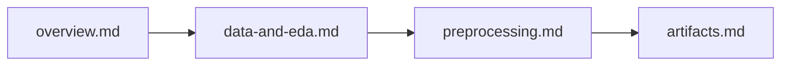

# Dokumentacja techniczna — adm-project-tgnn

Katalog [`docs/`](.) zawiera głębszą dokumentację projektu ADM (rekomendacje sesyjne na Yoochoose: GRU4Rec, TAGNN, TGN). Szybki start i komendy CLI są w root [`README.md`](../README.md).

---

## Od czego zacząć

| Krok | Jeśli chcesz… | Czytaj |
|------|----------------|--------|
| 1 | Zrozumieć problem, modele i plan eksperymentów | [`overview.md`](overview.md) |
| 2 | Poznać decyzje o danych (subsample, split, EDA) | [`data-and-eda.md`](data-and-eda.md) |
| 3 | Uruchomić i zrozumieć pipeline preprocessingu | [`preprocessing.md`](preprocessing.md) |
| 4 | Połączyć wyjście preprocessingu z treningiem | [`artifacts.md`](artifacts.md) |

---

## Spis dokumentacji

| Plik | Status | Opis |
|------|--------|------|
| [`overview.md`](overview.md) | gotowe | Problem, CTDG, oś GRU4Rec→TAGNN→TGN, mapa kodu modeli |
| [`data-and-eda.md`](data-and-eda.md) | gotowe | Decyzje z EDA i mapowanie na `src/preprocessing/` |
| [`preprocessing.md`](preprocessing.md) | gotowe | Pipeline danych end-to-end (load → export) |
| [`artifacts.md`](artifacts.md) | gotowe | `meta.json`, vocab, API `src/artifacts/`, DataModule |
| [`first_presentation.md`](first_presentation.md) | gotowe | Pełna prezentacja akademicka (problem, literatura, plan) |
| `training.md` | planowane | LightningCLI, fit/evaluate, W&B, checkpointy |
| `configuration.md` | planowane | Układ `config/*.yaml`, składanie eksperymentów |
| `evaluation.md` | planowane | Metryki, sampled Recall@K, baseline POP |
| `models/gru4rec.md` | planowane | Architektura GRU4Rec |
| `models/tagnn.md` | planowane | Architektura TAGNN |
| `models/tgn.md` | planowane | Architektura TGN |
| `experiments.md` | planowane | Macierz runów i wyniki |
| `projekt_info.pdf`, `adm_projekt_wm_mo.docx` | gotowe | Materiały formalne ADM |

---

## Mapa kodu → dokumentacja

Gdzie szukać implementacji w repozytorium:

| Obszar | Pliki w repo | Dokument |
|--------|--------------|----------|
| Surowe dane | [`scripts/download_raw_data.py`](../scripts/download_raw_data.py), `data/raw/*.dat` | [`data-and-eda.md`](data-and-eda.md) |
| EDA | [`notebooks/eda_yoochose.ipynb`](../notebooks/eda_yoochose.ipynb) | [`data-and-eda.md`](data-and-eda.md) |
| Walidacja preprocessingu | [`notebooks/validate_preprocessing.ipynb`](../notebooks/validate_preprocessing.ipynb) | [`data-and-eda.md`](data-and-eda.md), [`artifacts.md`](artifacts.md) |
| Preprocessing | [`src/preprocessing/`](../src/preprocessing/) | [`preprocessing.md`](preprocessing.md) |
| Config preprocessingu | [`config/preprocessing.yaml`](../config/preprocessing.yaml), [`src/preprocessing/config.py`](../src/preprocessing/config.py) | [`data-and-eda.md`](data-and-eda.md), [`preprocessing.md`](preprocessing.md) |
| Artefakty (odczyt) | [`src/artifacts/`](../src/artifacts/) | [`artifacts.md`](artifacts.md) |
| DataModule | [`src/data_modules/`](../src/data_modules/) | [`artifacts.md`](artifacts.md) |
| Modele | [`src/models/gru4rec/`](../src/models/gru4rec/), [`tagnn/`](../src/models/tagnn/), [`tgn/`](../src/models/tgn/) | [`overview.md`](overview.md) |
| Trening CLI | [`src/main.py`](../src/main.py), [`src/utils/cli.py`](../src/utils/cli.py) | [`overview.md`](overview.md) |
| Ewaluacja | [`src/evaluation/`](../src/evaluation/) | [`overview.md`](overview.md) |
| Config treningu | [`config/default.yaml`](../config/default.yaml), `config/data/`, `config/model/`, `config/experiments/` | [`artifacts.md`](artifacts.md) |
| W&B | [`src/config/wandb_settings.py`](../src/config/wandb_settings.py) | root README |
| Testy | [`tests/`](../tests/) | każdy odpowiedni dokument techniczny |

---

## Linki zewnętrzne

| Link | Opis |
|------|------|
| [Weights & Biases](https://wandb.ai/project-nn/adm-project-tgnn) | logi treningów, metryki |
| [HackMD — notatki](https://hackmd.io/56eeHBjMQfmq4Wh2M82m4A) | prezentacja / notatki zespołu |
| [Yoochoose na Kaggle](https://www.kaggle.com/datasets/chadgostopp/recsys-challenge-2015) | surowe dane |

---

## Konwencje dokumentów technicznych

Dokumenty pipeline’owe i modelowe (wzór: [`preprocessing.md`](preprocessing.md)) stosują ten sam szkielet:

1. **Cel** — co robi moduł i gdzie siedzi w pipeline
2. **Uruchomienie** — komendy CLI
3. **Konfiguracja** — YAML + tabela parametrów
4. **Przepływ** — diagram mermaid
5. **Moduły** — pliki `src/` z opisami i cytatami kodu
6. **Kontrakt** — kolumny, indeksy, shape’y
7. **Testy** — `tests/test_*.py`

Odwołania do kodu: linki względne do plików w repo; cytaty w formacie `startLine:endLine:ścieżka` tam, gdzie kontrakt jest nieoczywisty.
