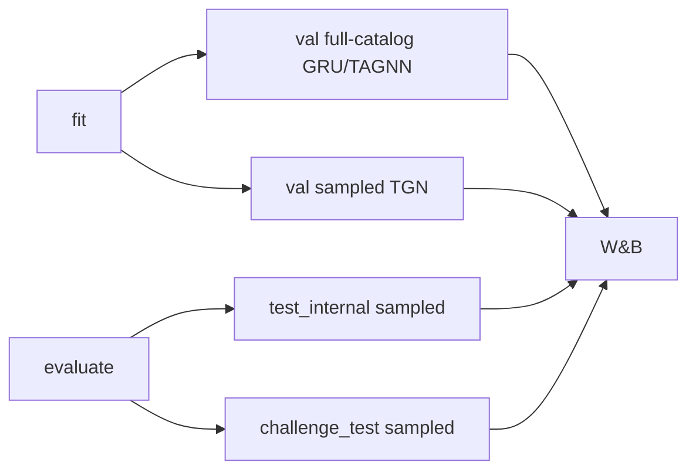

# Ewaluacja i metryki

Moduł [`src/evaluation/`](../src/evaluation/) implementuje metryki rankingowe, ewaluację na **próbce kandydatów** (sampled) oraz baseline **popularności (POP@K)**. Wspólna logika logowania metryk siedzi w [`src/training/base_module.py`](../src/training/base_module.py).

---

## Dwa tryby ewaluacji

| Tryb | Kiedy | Implementacja |
|------|-------|---------------|
| **Full-catalog** | Walidacja GRU4Rec / TAGNN | Logity dla wszystkich itemów → `batch_ranking_metrics` |
| **Sampled** | Walidacja TGN; **wszystkie** modele na `evaluate` (test) | Target + `eval_num_negatives` losowych negatywów → `batch_sampled_ranking_metrics` |

---

## Metryki rankingowe

Implementacja: [`src/evaluation/metrics.py`](../src/evaluation/metrics.py).

Domyślne K: `(1, 5, 10, 20)` — stała `DEFAULT_KS`.

| Metryka | Opis |
|---------|------|
| `recall@K` / `hit@K` | Czy prawdziwy item jest w top-K |
| `mrr@20` | Odwrotność rangi trafienia (max K=20) |
| `ndcg@20` | NDCG przy jednej relewantnej pozycji (IDCG=1) |

Prefiks w logach W&B:

- `val/recall@20` — full-catalog na walidacji
- `val/sampled_recall@20` — sampled na walidacji (TGN)
- `test_internal/sampled_recall@20`, `challenge_test/sampled_recall@20` — po `evaluate`

---

## Sampled evaluation

Implementacja: [`src/evaluation/sampled.py`](../src/evaluation/sampled.py).

### Budowa zbioru kandydatów

`build_candidate_sets(targets, num_items, num_negatives, generator=...)`:

1. Dla każdego przykładu losuje `num_negatives` **unikalnych** itemów (uniform), różnych od targetu.
2. Łączy target z negatywami i **tasuje** kolejność kolumn.
3. Model zwraca score per kandydat (nie pełny wektor katalogu).

Parametr `eval_num_negatives` (domyślnie **99**) jest wspólny dla wszystkich modeli w `NextItemLitModule`.

Ziarno losowania: `eval_seed` lub `torch.initial_seed()` + offset `dataloader_idx` — reprodukowalność między `test_internal` a `challenge_test`.

### Trening TGN — negatywy BCE

Osobna ścieżka: `sample_negative_items()` z opcją `uniform` lub `popularity` (wagi z train events). To **nie** jest to samo co `eval_num_negatives` — dotyczy tylko lossu BCE podczas `fit`.

---

## Baseline popularności (POP)

Implementacja: [`src/evaluation/baselines.py`](../src/evaluation/baselines.py).

- Lista top-K itemów z `meta.json` → `stats.popularity.top20_item_ids` (kliknięcia train).
- Ta sama lista rekomendowana każdej sesji → `recall@K_pop`.
- Liczone na val (podczas `fit`) oraz na obu loaderach testowych (podczas `evaluate`).

Mapowanie ID → indeks modelu:

- GRU4Rec / TAGNN: `popularity_top_k_gru_indices`
- TGN: `popularity_top_k_tgn_indices`

---

## Zbiory testowe

| Split | Źródło | Uwagi |
|-------|--------|-------|
| `test_internal` | 15% hold-out z preprocessingu | Ten sam subsample co train |
| `challenge_test` | Pełny `yoochoose-test.dat` | Cold start; bez subsample |

Oba są zwracane przez DataModule jako lista loaderów; `NextItemLitModule.test_step` używa `dataloader_idx` do prefiksu metryk.

---

## Przepływ metryk w Lightning

---

## Testy

| Plik | Zakres |
|------|--------|
| [`tests/test_metrics.py`](../tests/test_metrics.py) | Recall, MRR, NDCG — wartości na małych tensorach |
| [`tests/test_sampled_eval.py`](../tests/test_sampled_eval.py) | `build_candidate_sets`, sampled metryki, unikalność negatywów |
| [`tests/test_baselines.py`](../tests/test_baselines.py) | POP baseline z meta |
