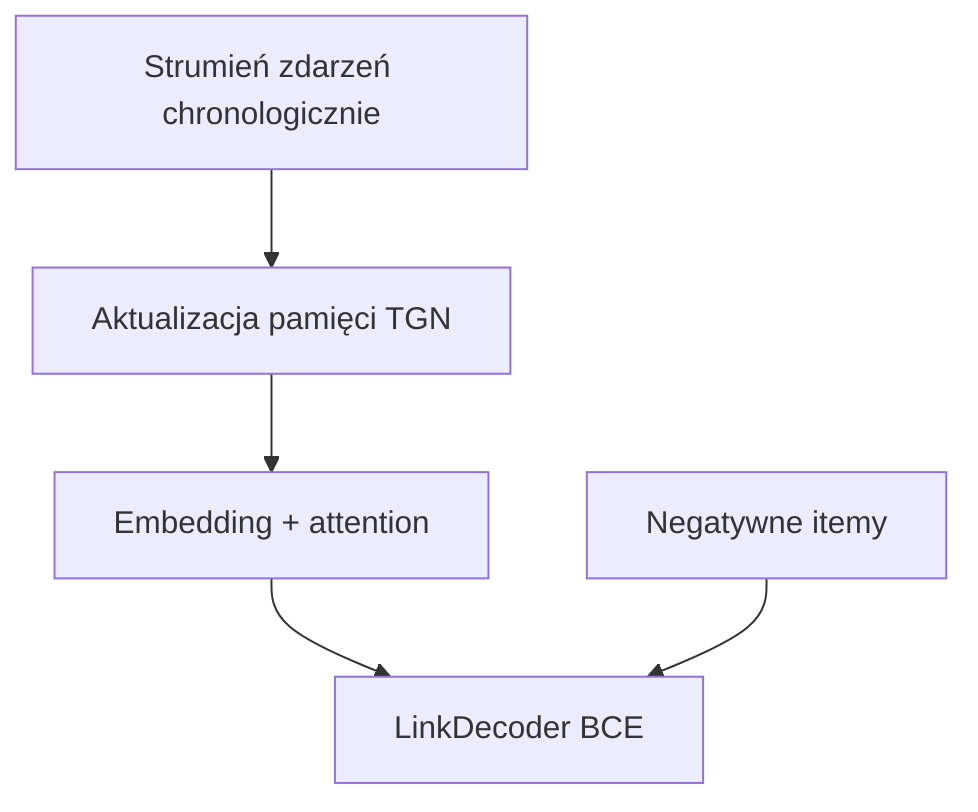

# TGN (Temporal Graph Network)

**TGN** modeluje rekomendacje jako **link prediction** na globalnym grafie dynamicznym sesja↔item w **czasie ciągłym**. Implementacja oparta na PyTorch Geometric (`torch_geometric.nn.models.tgn`) z własnym modułem pamięci, attention i dekoderem BCE.

Kod: [`src/models/tgn/`](../src/models/tgn/).

---

## Idea

| Element | W projekcie |
|---------|-------------|
| Węzły | Sesje + itemy (graf dwudzielny) |
| Zdarzenia | Kliknięcia (opcjonalnie buys) z timestampami |
| Pamięć | `SafeTGNMemory` — stan per węzeł, aktualizowany po każdym evencie |
| Trening | BCE: pozytywna krawędź vs losowe negatywy |
| Ewaluacja | Sampled Recall@K (nie full catalog) |

---

## Uruchomienie

```powershell
uv run python -m src.main fit `
  -c config/data/tgn_yoochoose.yaml `
  -c config/model/tgn.yaml `
  -c config/experiments/tgn_bce_baseline.yaml

uv run python -m src.main evaluate `
  -c config/data/tgn_yoochoose.yaml `
  -c config/model/tgn.yaml `
  -c config/experiments/tgn_bce_baseline.yaml `
  --ckpt_path best
```

---

## Konfiguracja

Plik [`config/model/tgn.yaml`](../config/model/tgn.yaml):

| Parametr | Opis |
|----------|------|
| `memory_dim`, `time_dim`, `embedding_dim` | Wymiary pamięci i embeddingów |
| `n_neighbors` | Sąsiedztwo do attention (TGN) |
| `num_negatives` | Negatywy per pozytyw w BCE train |
| `negative_sampling` | `uniform` lub `popularity` |
| `learning_rate`, `weight_decay` | Optymalizator Adam |
| `eval_num_negatives` | Negatywy przy sampled val/test (99) |
| `fast_eval` / `val_fast_eval` | Przyspieszenie ewaluacji (chunkowanie itemów) |

`num_items` i `num_sessions_train` — z artefaktów (CLI).

---

## Moduły

| Plik | Rola |
|------|------|
| [`model.py`](../src/models/tgn/model.py) | `TGNModel`: memory, GNN, decoder, replay zdarzeń |
| [`memory.py`](../src/models/tgn/memory.py) | `SafeTGNMemory` wrapper |
| [`embedding.py`](../src/models/tgn/embedding.py) | `GraphAttentionEmbedding` |
| [`decoder.py`](../src/models/tgn/decoder.py) | `LinkDecoder` — score (session, item) |
| [`dataset.py`](../src/models/tgn/dataset.py) | `events.parquet`, `examples.parquet` |
| [`temporal_batch.py`](../src/models/tgn/temporal_batch.py) | Batchowanie strumienia zdarzeń |
| [`node_ids.py`](../src/models/tgn/node_ids.py) | Mapowanie sesja/item → global node id |
| [`module.py`](../src/models/tgn/module.py) | `TGNLitModule` |
| [`src/data_modules/tgn.py`](../src/data_modules/tgn.py) | DataModule, warmup events |

### Przepływ treningu



### Warmup przy evaluate

Przed testem moduł **odtwarza zdarzenia train** (chunkami), żeby pamięć TGN odzwierciedlała stan po treningu — bez tego link prediction na cold graph byłby bezużyteczny.

---

## Dane

- `tgn/events.parquet` — chronologiczny strumień (session, item, timestamp, typ)
- `tgn/examples.parquet` — pary (kontekst → target) do BCE / eval
- Wariant `with_buys`: osobny katalog `subsample_1_32_with_buys/`

Szczegóły: [`artifacts.md`](../artifacts.md), [`preprocessing.md`](../preprocessing.md).

---

## Metryki

| Etap | Metryka |
|------|---------|
| Train | `train/loss` (BCE) |
| Val | `val/sampled_recall@20` (monitor checkpointu) |
| Test | `test_internal/sampled_*`, `challenge_test/sampled_*` |

Early stopping i ModelCheckpoint śledzą `val/sampled_recall@20` (nadpisane w `tgn_bce_baseline.yaml`).

---

## Testy

| Plik | Zakres |
|------|--------|
| [`tests/test_tgn_lit.py`](../tests/test_tgn_lit.py) | LightningModule, BCE, eval warmup |
| [`tests/test_tgn_model.py`](../tests/test_tgn_model.py) | Forward, replay |
| [`tests/test_tgn_memory.py`](../tests/test_tgn_memory.py) | Pamięć |
| [`tests/test_tgn_decoder.py`](../tests/test_tgn_decoder.py) | Decoder |
| [`tests/test_tgn_dataset.py`](../tests/test_tgn_dataset.py) | Dataset |
| [`tests/test_tgn_datamodule.py`](../tests/test_tgn_datamodule.py) | DataModule |
| [`tests/test_tgn_node_ids.py`](../tests/test_tgn_node_ids.py) | Mapowanie node id |
| [`tests/test_tgn_session_offset.py`](../tests/test_tgn_session_offset.py) | Offset sesji |

Fixtures: [`tests/tgn_fixtures.py`](../tests/tgn_fixtures.py).
