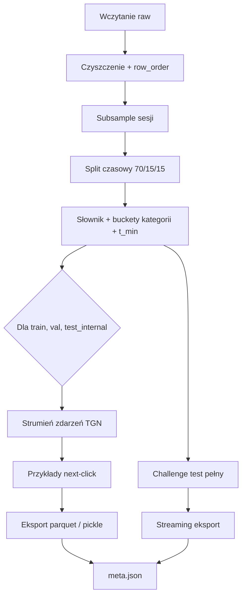

# Preprocessing danych Yoochoose

Pipeline w `src/preprocessing/` przygotowuje surowe pliki Yoochoose pod trzy modele rekomendacji sesyjnej: **GRU4Rec**, **TAGNN** i **TGN**. Jeden przebieg generuje wspólny słownik itemów, splity czasowe oraz artefakty wejściowe dla każdego modelu.

Decyzje projektowe (subsample, split, obsługa powtórzeń, tryb ewaluacji) wynikają z analizy EDA — szczegóły w [`notebooks/eda_yoochose.ipynb`](../notebooks/eda_yoochose.ipynb). Walidację wyjścia można przeprowadzić w [`notebooks/validate_preprocessing.ipynb`](../notebooks/validate_preprocessing.ipynb).

---

## Uruchomienie

**Wariant domyślny (clicks-only, subsample 1/32):**

```powershell
uv run python -m src.preprocessing --config config/preprocessing.yaml --force
```

**Inne warianty:**

| Cel | Komenda |
|-----|---------|
| TGN z zakupami (`buys`) | `uv run python -m src.preprocessing --include-buys --force` |
| Mniejszy subsample (smoke test) | `uv run python -m src.preprocessing --fraction 0.001 --force` |

Punkt wejścia CLI: [`src/preprocessing/__main__.py`](../src/preprocessing/__main__.py).  
Orkiestracja całego pipeline’u: [`run_preprocessing()`](../src/preprocessing/pipeline.py) w [`src/preprocessing/pipeline.py`](../src/preprocessing/pipeline.py).

---

## Konfiguracja

Parametry trzymane są w [`config/preprocessing.yaml`](../config/preprocessing.yaml) i ładowane do dataclass [`PreprocessConfig`](../src/preprocessing/config.py).

| Parametr | Domyślnie | Opis |
|----------|-----------|------|
| `subsample_fraction` | `0.03125` (1/32) | Ułamek najstarszych sesji (chronologicznie) |
| `split_ratios` | `[0.70, 0.15, 0.15]` | Granice train / val / `test_internal` po czasie kliknięć |
| `min_session_clicks` | `2` | Sesje krótsze są pomijane przy generowaniu przykładów |
| `remove_exact_duplicates` | `true` | Usuwa wiersze z tym samym `(session_id, item_id, timestamp)` |
| `merge_consecutive_repeats` | `false` | Zarezerwowane; w v1 powtórzenia `A→A` zostają |
| `include_buys` | `false` | Czy do strumienia TGN dodać zdarzenia zakupu |
| `eval_mode` | `last_click` | Na val/test tylko ostatni klik w sesji |
| `raw_dir` | `data/raw` | Katalog z plikami `.dat` |
| `output_root` | `data/processed` | Korzeń katalogów wyjściowych |

Katalog wyjściowy jest deterministyczny:

```text
{output_root}/subsample_{1_N|full}_{clicks_only|with_buys}/
```

Logika nazewnictwa: [`PreprocessConfig.output_dir()`](../src/preprocessing/config.py).

---

## Przepływ pipeline’u



Kolejność kroków w kodzie (`run_preprocessing`):

1. **Wczytanie** — `load_clicks`, `load_buys`, `load_test`
2. **Czyszczenie** — opcjonalne deduplikowanie, `add_row_order`
3. **Subsample** — `subsample_sessions` (pełne sesje, najstarsze `fraction`)
4. **Split** — granice czasowe + przypisanie całych sesji
5. **Słownik i cechy globalne** — vocab z train, buckety kategorii, `t_min`
6. **Pętla po splitach** — event stream → przykłady → zapis artefaktów
7. **Challenge test** — pełny `yoochoose-test.dat` (bez subsample), streaming zapisu
8. **Meta** — `meta.json` ze statystykami i konwencjami indeksów

---

## Moduły i odpowiedzialności

### 1. Wczytanie surowych danych — `load.py`

Pliki CSV bez nagłówka z katalogu `data/raw/`:

| Plik | Funkcja | Kolumny |
|------|---------|---------|
| `yoochoose-clicks.dat` | `load_clicks()` | `session_id`, `timestamp`, `item_id`, `category` |
| `yoochoose-buys.dat` | `load_buys()` | `session_id`, `timestamp`, `item_id`, `price`, `quantity` |
| `yoochoose-test.dat` | `load_test()` | jak clicks |

Wspólny parser: `_read_dat()` — separator `,`, timestamp w formacie ISO z strefą czasową.

```9:45:src/preprocessing/load.py
CLICK_COLUMNS = ["session_id", "timestamp", "item_id", "category"]
BUY_COLUMNS = ["session_id", "timestamp", "item_id", "price", "quantity"]
// ...
def load_clicks(raw_dir: Path) -> pd.DataFrame:
    df = _read_dat(raw_dir / "yoochoose-clicks.dat", CLICK_COLUMNS)
// ...
def load_test(raw_dir: Path) -> pd.DataFrame:
    df = _read_dat(raw_dir / "yoochoose-test.dat", CLICK_COLUMNS)
```

Skrypt pobierania danych: [`scripts/download_raw_data.py`](../scripts/download_raw_data.py).

---

### 2. Czyszczenie — `clean.py`

- **`remove_exact_duplicates(df, keys)`** — usuwa dokładne duplikaty wierszy; liczba usuniętych trafia do `df.attrs["duplicates_removed"]` (statystyka w `meta.json`).
- **`add_row_order(df)`** — stabilny klucz sortowania przy równych timestampach (`row_order` = pozycja w pliku).

```8:18:src/preprocessing/clean.py
def remove_exact_duplicates(df: pd.DataFrame, keys: list[str]) -> pd.DataFrame:
    before = len(df)
    out = df.drop_duplicates(subset=keys, keep="first").copy()
    out.attrs["duplicates_removed"] = before - len(out)
    return out

def add_row_order(df: pd.DataFrame) -> pd.DataFrame:
    out = df.copy()
    out["row_order"] = range(len(out))
    return out
```

---

### 3. Subsample sesji — `subsample.py`

**`subsample_sessions(clicks, buys, fraction)`** zachowuje najstarsze `fraction` sesji (według czasu pierwszego kliknięcia). Sesja wchodzi w całości lub wcale — zarówno clicks, jak i buys tej sesji są filtrowane tym samym zestawem `session_id`.

```8:23:src/preprocessing/subsample.py
def subsample_sessions(
    clicks: pd.DataFrame,
    buys: pd.DataFrame,
    fraction: float,
) -> tuple[pd.DataFrame, pd.DataFrame, pd.Index]:
    """Keep the oldest `fraction` of sessions (by first click time)."""
    if fraction >= 1.0:
        return clicks.copy(), buys.copy(), clicks["session_id"].unique()
    session_start = clicks.groupby("session_id")["timestamp"].min().sort_values()
    n_keep = max(1, int(len(session_start) * fraction))
    kept = session_start.iloc[:n_keep].index
    // ...
```

---

### 4. Split czasowy — `split.py`

Split jest **chronologiczny po kliknięciach**, ale **przypisanie odbywa się na poziomie sesji** (cała sesja trafia do jednego splitu według czasu pierwszego kliknięcia).

- **`compute_split_boundaries(clicks, ratios)`** — percentyle na posortowanych timestampach kliknięć → `train_end`, `val_end`.
- **`assign_session_splits(clicks, boundaries)`** — mapowanie `session_id → train | val | test_internal`.
- **`split_frame(df, session_split)`** — rozbicie ramki na trzy słowniki.

Nazwy splitów: `train`, `val`, `test_internal` (`SPLIT_NAMES`).

```18:53:src/preprocessing/split.py
def compute_split_boundaries(
    clicks: pd.DataFrame,
    ratios: tuple[float, float, float],
) -> SplitBoundaries:
    // ...
def assign_session_splits(
    clicks: pd.DataFrame,
    boundaries: SplitBoundaries,
) -> pd.Series:
    """Map session_id -> split name using time of first click in session."""
    // ...
```

---

### 5. Słownik itemów — `vocab.py`

Słownik budowany **wyłącznie z kliknięć train** (`build_item_vocab`).

| Model | Indeks znanych itemów | UNK |
|-------|----------------------|-----|
| GRU4Rec / TAGNN | `1 … n_items` | `n_items + 1` |
| TGN | `0 … n_items - 1` | `n_items` |

Padding GRU4Rec: `PAD_IDX = 0` ([`src/common/constants.py`](../src/common/constants.py)) — używany przy batchowaniu, nie w zapisanych listach historii.

Metody mapowania: `ItemVocab.gru_index()`, `ItemVocab.tgn_index()`.  
Zapis: `vocab/item_vocab.json`. Odczyt w treningu: [`src/artifacts/vocab.py`](../src/artifacts/vocab.py).

```31:66:src/preprocessing/vocab.py
    def gru_index(self, raw_item_id: int, known: bool) -> int:
        if not known:
            return self.n_items + 1
        return self.item2idx[raw_item_id]

    def tgn_index(self, raw_item_id: int, known: bool) -> int:
        if not known:
            return self.n_items
        return self.item2idx[raw_item_id] - 1

def build_item_vocab(train_clicks: pd.DataFrame) -> ItemVocab:
    unique_items = sorted(train_clicks["item_id"].unique())
    item2idx = {item_id: idx + 1 for idx, item_id in enumerate(unique_items)}
```

---

### 6. Kategorie i buckety — `category.py`

Pole `category` w Yoochoose jest niejednorodne (oferty specjalne, kategorie produktów, kontekst marki itd.). Pipeline mapuje je na **6 bucketów** (`BUCKET_NAMES`):

| Bucket | Reguła (`classify_category`) |
|--------|-------------------------------|
| `no_category` | wartość `"0"` |
| `special_offer` | `"S"` |
| `product_category` | `"1"` … `"12"` |
| `brand_context` | cyfry, długość ≥ 8 |
| `other` | pozostałe |
| `missing` | brak / NaN |

Dla każdego itemu w train wyznaczany jest **dominujący bucket** (`item_category_mode`) — używany jako cecha krawędzi TGN. Mapowanie bucket → indeks: `cat_bucket2idx.json`.

---

### 7. Normalizacja czasu — `timestamps.py`

- **`compute_t_min(train_clicks)`** — najwcześniejszy timestamp w train.
- **`to_t_sec(series, t_min)`** — sekundy od `t_min` (float), wspólna skala czasu dla całego eksperymentu.

---

### 8. Strumień zdarzeń TGN — `events.py`

**`build_event_stream()`** łączy wzbogacone kliknięcia i (opcjonalnie) zakupy w jedną chronologiczną tabelę zdarzeń per split.

Kroki wewnętrzne:

1. **`enrich_clicks()`** — `t_sec`, `event_type=0`, indeksy GRU/TGN, `cat_bucket_idx`, flaga `known_item`.
2. **`enrich_buys()`** (gdy `include_buys=True`) — `event_type=1`, `price_log=log1p(price)`, `quantity`, brak kategorii.
3. Sortowanie: `session_id`, `timestamp`, `event_type`, `row_order` (stabilne `mergesort`).
4. **`event_id`** — globalny indeks zdarzenia w ramach splitu.
5. **`assign_session_idx()`** — `session_id` → `0…N-1` w obrębie splitu.

Eksport do TGN: **`events_to_tgn_frame()`** — kolumny pod `TemporalData` w kodzie treningowym.

```67:121:src/preprocessing/events.py
def build_event_stream(
    clicks: pd.DataFrame,
    buys: pd.DataFrame,
    vocab: ItemVocab,
    item_buckets: pd.Series,
    known_items: set[int],
    t_min: pd.Timestamp,
    include_buys: bool,
) -> pd.DataFrame:
    // ...
def events_to_tgn_frame(events: pd.DataFrame) -> pd.DataFrame:
    """Columns required for TemporalData construction in training code."""
    return events[
        [
            "event_id",
            "session_id",
            "session_idx",
            // ...
        ]
    ].copy()
```

Itemy spoza słownika train (`known_items`) dostają indeks UNK — szczególnie istotne na `challenge_test` (cold start).

---

### 9. Przykłady next-click — `examples.py`

Zadanie: przewidzieć **następny kliknięty item** w sesji.

| Split | Strategia |
|-------|-----------|
| `train` | Sliding window — każda pozycja `1 … n_clicks-1` jako target |
| `val`, `test_internal`, `challenge_test` | Tylko **ostatni klik** (`eval_mode=last_click`) |

Dla każdego przykładu generowane są trzy rekordy (wspólne `example_id`):

| Model | Pola kluczowe |
|-------|---------------|
| GRU4Rec | `history_item_idx`, `target_item_idx` |
| TAGNN | `item_ids` (historia), `target_item_idx`, `history_len` |
| TGN | `target_event_id`, `prefix_last_event_id`, `prefix_num_events`, `target_t_sec`, `session_idx` |

Prefiks TGN odnosi się do zdarzeń **przed** targetem w strumieniu (kliknięcia + ewentualnie buys) — pozwala odtworzyć stan grafu w momencie predykcji.

Generator strumieniowy: **`iter_examples_for_split()`** — używany dla dużego `challenge_test` bez trzymania wszystkiego w RAM.

```58:119:src/preprocessing/examples.py
        if is_train:
            target_positions = range(1, n_clicks)
        elif eval_mode == "last_click":
            target_positions = [n_clicks - 1]
        // ...
            tgn_row = {
                "example_id": example_id,
                // ...
                "target_event_id": target_event_id,
                "prefix_last_event_id": prefix_last_event_id,
                "prefix_num_events": prefix_num_events,
            }
```

---

### 10. Eksport artefaktów — `export.py`

**Per split** (`train`, `val`, `test_internal`):

| Ścieżka | Zawartość |
|---------|-----------|
| `{split}/tgn/events.parquet` | Pełny strumień zdarzeń TGN |
| `{split}/tgn/examples.parquet` | Przykłady nadzoru next-click |
| `{split}/gru4rec_examples.parquet` | Tylko gdy `clicks_only` |
| `{split}/tagnn_examples.pkl` | Lista rekordów TAGNN (pickle) |

**Challenge test** (`challenge_test/`):

- Pełny `yoochoose-test.dat` — **bez subsample**.
- `tgn/events.parquet` + strumieniowy zapis przykładów (`write_examples_streaming`, batch 100k).
- Statystyka `cold_start_items` w `meta.json`.

**Meta:** `write_meta()` → `meta.json` — konfiguracja, granice splitu, statystyki, konwencje indeksów, flagi eksportu.

Odczyt metadanych w treningu: [`src/artifacts/meta.py`](../src/artifacts/meta.py).

---

## Struktura katalogu wyjściowego

```text
data/processed/subsample_1_32_clicks_only/
├── meta.json
├── vocab/
│   ├── item_vocab.json
│   └── cat_bucket2idx.json
├── train/
│   ├── gru4rec_examples.parquet
│   ├── tagnn_examples.pkl
│   └── tgn/
│       ├── events.parquet
│       └── examples.parquet
├── val/                    # ta sama struktura
├── test_internal/
└── challenge_test/
    ├── gru4rec_examples.parquet   # opcjonalnie
    └── tgn/
        ├── events.parquet
        └── examples.parquet
```

Wariant `with_buys` zapisuje ten sam układ, ale **bez** plików GRU4Rec/TAGNN (`export_sequence_models=False`) — strumień TGN zawiera też zakupy.

---

## Kontrakt wejścia modeli

Szczegółowy opis kolumn i indeksów jest w docstringu [`PreprocessConfig`](../src/preprocessing/config.py) (linie 63–87) oraz w sekcji `index_conventions` pliku `meta.json` ([`write_meta()`](../src/preprocessing/export.py)).

**GRU4Rec** — sekwencja indeksów itemów, predykcja next-item.  
**TAGNN** — graf sesji budowany w kodzie treningowym: węzeł = klik, krawędź `(i → i+1)` ([`src/models/tagnn/dataset.py`](../src/models/tagnn/dataset.py)).  
**TGN** — graf dwudzielny sesja–item w czasie; atrybuty krawędzi: `cat_bucket_idx`, `price_log`, `quantity`, `event_type` ([`src/models/tgn/dataset.py`](../src/models/tgn/dataset.py)).

Downstream czyta artefakty wyłącznie przez pakiet **`src/artifacts/`** (read-only), nie importuje modułów preprocessingu.

---

## Testy

| Plik | Zakres |
|------|--------|
| [`tests/test_preprocessing.py`](../tests/test_preprocessing.py) | `classify_category`, split, vocab |
| [`tests/test_yaml_config.py`](../tests/test_yaml_config.py) | Ładowanie `PreprocessConfig` z YAML |

---

## Mapa plików `src/preprocessing/`

| Plik | Rola |
|------|------|
| [`__main__.py`](../src/preprocessing/__main__.py) | CLI |
| [`pipeline.py`](../src/preprocessing/pipeline.py) | Orkiestracja end-to-end |
| [`config.py`](../src/preprocessing/config.py) | `PreprocessConfig` + kontrakty modeli |
| [`load.py`](../src/preprocessing/load.py) | Wczytanie `.dat` |
| [`clean.py`](../src/preprocessing/clean.py) | Deduplikacja, `row_order` |
| [`subsample.py`](../src/preprocessing/subsample.py) | Subsample sesji |
| [`split.py`](../src/preprocessing/split.py) | Split 70/15/15 |
| [`vocab.py`](../src/preprocessing/vocab.py) | Słownik itemów |
| [`category.py`](../src/preprocessing/category.py) | Buckety kategorii |
| [`timestamps.py`](../src/preprocessing/timestamps.py) | `t_sec` względem train |
| [`events.py`](../src/preprocessing/events.py) | Strumień zdarzeń TGN |
| [`examples.py`](../src/preprocessing/examples.py) | Przykłady next-click |
| [`export.py`](../src/preprocessing/export.py) | Zapis parquet / pickle / meta |
