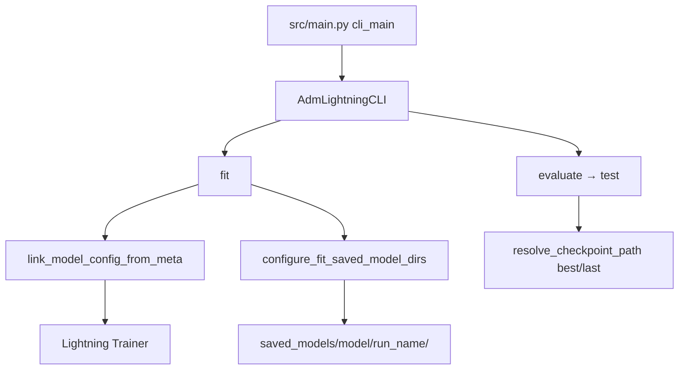

# Trening modeli (LightningCLI)

Trening i ewaluacja wszystkich modeli (GRU4Rec, TAGNN, TGN) odbywa się przez **PyTorch Lightning CLI** w [`src/main.py`](../src/main.py). Subkomenda `evaluate` jest mapowana na Lightning `test` — dzięki temu ten sam zestaw plików YAML obsługuje zarówno `fit`, jak i ocenę na zbiorach testowych.

**Środowisko baseline’ów:** eksperymenty produkcyjne uruchamialiśmy na **NVIDIA T4** w **[Lightning AI Studio](https://lightning.ai/)**. Lokalnie wystarczy `uv`; trening z `accelerator: gpu` wymaga CUDA.

---

## Uruchomienie

Workflow: **`fit`** (train + val co epokę) → **`evaluate`** (osobno na `test_internal` i `challenge_test`).

```powershell
# GRU4Rec baseline
uv run python -m src.main fit `
  -c config/data/gru4rec_yoochoose.yaml `
  -c config/model/gru4rec.yaml `
  -c config/experiments/gru4rec_baseline.yaml

uv run python -m src.main evaluate `
  -c config/data/gru4rec_yoochoose.yaml `
  -c config/model/gru4rec.yaml `
  -c config/experiments/gru4rec_baseline.yaml `
  --ckpt_path best
```

TAGNN i TGN — analogicznie z odpowiednimi plikami `config/data/`, `config/model/`, `config/experiments/` (szczegóły w root [`README.md`](../README.md) i [`configuration.md`](configuration.md)).

**Smoke (CPU, szybka weryfikacja kodu):** `gru4rec_smoke.yaml`, `tagnn_smoke.yaml`, `tgn_smoke.yaml` — wyłączają W&B i ograniczają liczbę batchy/epok.

---

## Przepływ CLI



---

## Moduły

| Plik | Rola |
|------|------|
| [`src/main.py`](../src/main.py) | Punkt wejścia; mapuje `evaluate` → `test` |
| [`src/utils/cli.py`](../src/utils/cli.py) | `AdmLightningCLI`: domyślny `config/default.yaml`, linkowanie meta → model, ścieżki checkpointów |
| [`src/training/base_module.py`](../src/training/base_module.py) | `NextItemLitModule`: wspólny train/val/test, metryki, POP baseline |
| [`src/training/paths.py`](../src/training/paths.py) | Layout `saved_models/<model>/<run_name>/best.ckpt` |
| [`src/data_modules/`](../src/data_modules/) | Lightning DataModule per model |
| [`src/config/wandb_settings.py`](../src/config/wandb_settings.py) | Entity `project-nn`, project `adm-project-tgnn` |

### Linkowanie konfiguracji z artefaktów

Przed instancjacją klas CLI wywołuje `link_model_config_from_meta()`:

- **GRU4Rec / TAGNN:** `num_embeddings` z `meta.json` (rozmiar słownika itemów).
- **TGN:** `num_items`, `num_sessions_train` ze strumieni zdarzeń w `data/processed/`.

Dzięki temu w YAML nie trzeba ręcznie wpisywać rozmiaru katalogu po preprocessingu.

### Zapis modeli (`saved_models/`)

Podczas `fit`, `configure_fit_saved_model_dirs()` ustawia:

- `trainer.default_root_dir`
- `ModelCheckpoint.dirpath` → `saved_models/<model>/<run_name>/`
- `WandbLogger.save_dir` → ten sam katalog

```text
saved_models/
├── gru4rec/gru4rec-baseline/best.ckpt
├── tagnn/tagnn-baseline/best.ckpt
└── tgn/tgn-bce-baseline/best.ckpt
```

`--ckpt_path best` (lub `last`) w `evaluate` jest rozwiązywane przez `resolve_saved_checkpoint()` na podstawie nazwy modelu (z DataModule) i nazwy runu (z `trainer.logger.init_args.name`).

### Checkpoint i early stopping

Domyślne monitory w [`config/default.yaml`](../config/default.yaml):

| Model | Monitor checkpoint / early stop |
|-------|--------------------------------|
| GRU4Rec, TAGNN | `val/recall@20` |
| TGN | `val/sampled_recall@20` (nadpisane w `tgn_bce_baseline.yaml`) |

---

## Kontrakt treningu

| Etap | GRU4Rec / TAGNN | TGN |
|------|-----------------|-----|
| Train loss | Cross-entropy (full catalog) | BCE na parach pozytywnych/negatywnych |
| Val | Full-catalog Recall@K | Sampled Recall@K (`eval_num_negatives` negatywów) |
| Test (`evaluate`) | Sampled Recall@K na `test_internal` i `challenge_test` | Sampled Recall@K + warmup pamięci TGN na train events |

Metryki i baseline POP — [`evaluation.md`](evaluation.md).

---

## Testy

| Plik | Zakres |
|------|--------|
| [`tests/test_cli.py`](../tests/test_cli.py) | Linkowanie meta, ścieżki checkpointów, `AdmLightningCLI` |
| [`tests/test_training_paths.py`](../tests/test_training_paths.py) | `saved_model_dir`, `resolve_saved_checkpoint` |
| [`tests/test_training_scaffold.py`](../tests/test_training_scaffold.py) | Szkielet `NextItemLitModule` |
| [`tests/test_*_lit.py`](../tests/) | Per-model LightningModule (GRU4Rec, TAGNN, TGN) |
